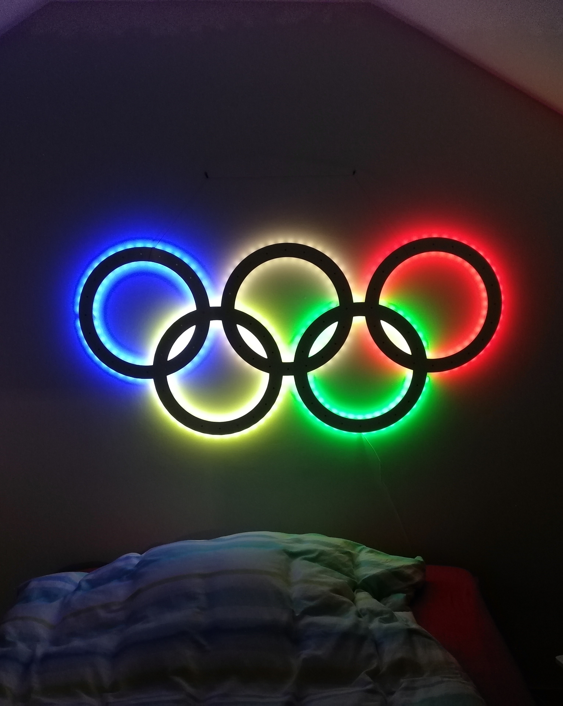
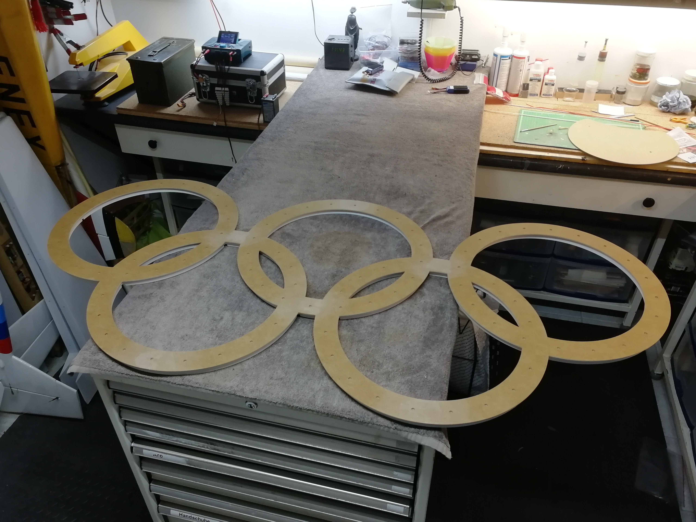
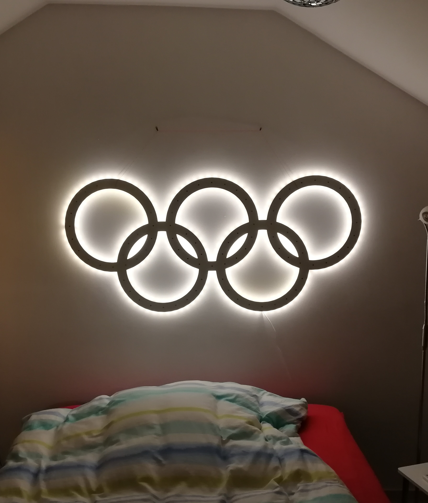
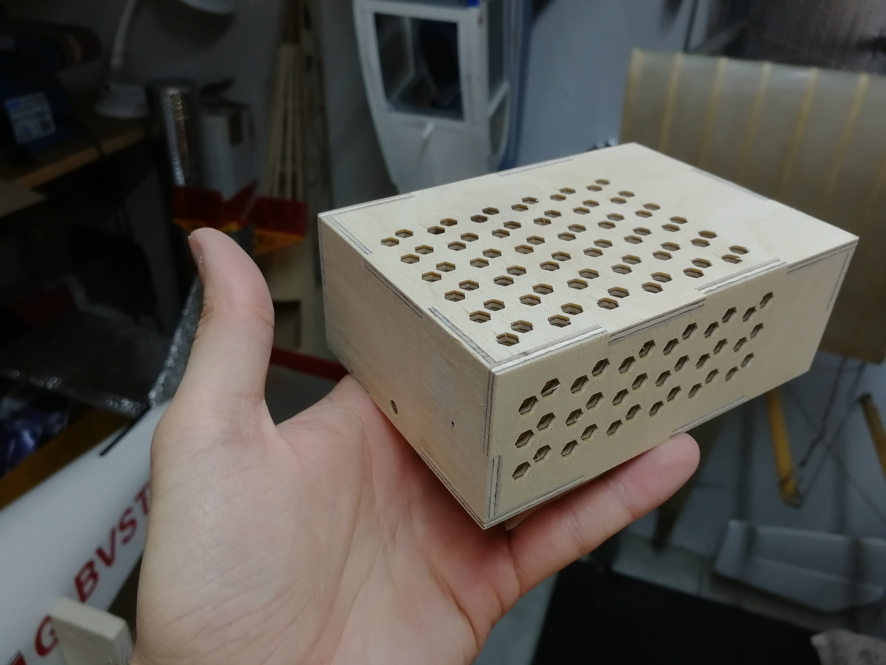
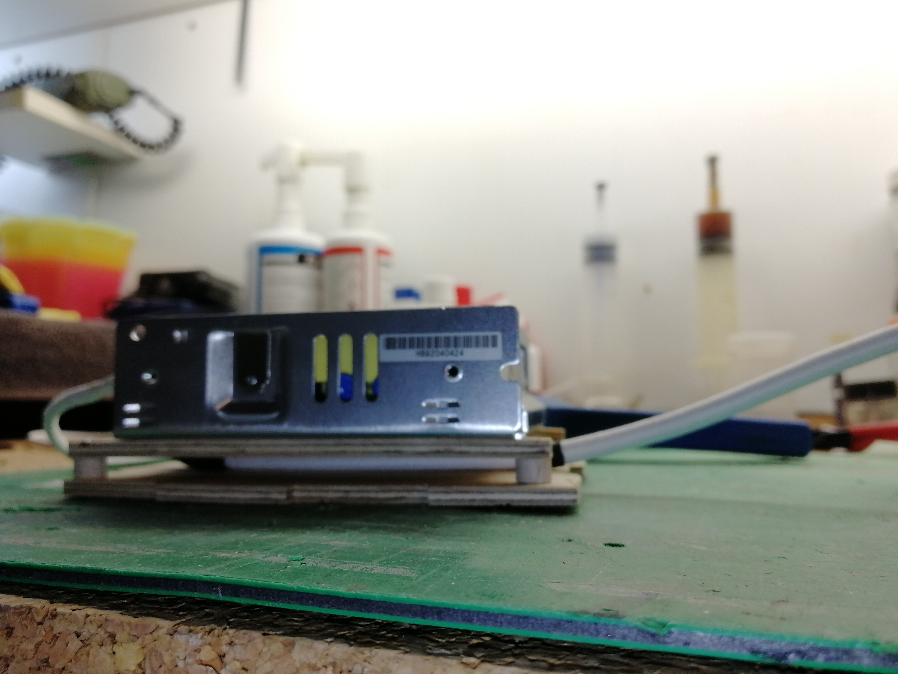

# Olympische Ringe RGBW Lampe

  

### Eine Open-Source RGB Lampe in Form der Olympischen Ringe als DIY Projekt
### Designed by Fabian Spinrath ([@twinking92](https://github.com/twinking92))

Die olympischen Ringe bestehen aus acht Segmenten welche aus 3mm und 12mm starken MDF-Platten gefräst und anschließend zusammen "gepuzzelt" werden. In der Oberfläche der Ringe sind 86 Magnete eingelassen, sodass die Lampe auch als Pinnwand genutzt werden kann.
Die Beleuchtung basiert auf individuell adressierbaren RGBW LED-Streifen des Typs SK6812 welche von einem ESP32 bzw. einem ESP8266 angesteuert werden. Über einen Induktiven Taster unter der Oberfläche der Ringe kann die Lampe angeschalten werden. Es gibt zwei Einschalttypen und Animationen:

- Fade On / Fade Off für weißes Licht (einfacher Klick)
- Step On / Step Off für Licht in den Farben der olympischen Ringe (Doppelklick)

Mit einem langen Klick kann die Helligkeit in fünf Stufen durchgeschalten werden.

Die Animationen werden non-blocking ausgeführt, daher wäre es möglich einen Server auf den ESP einzurichten und die Lampe so fernzusteuern. Die Funktion ist jedoch noch nicht implementiert.

Das 5V 10A Netzteil von Meanwell wird in einem ebenfalls gefrästen Gehäuse aus 4mm starken Multiplex-Platten untergebracht.

# Mehr Bilder

  |  |  
 -----------------------------|---------------------------|------------------------
  |  |  
  |  |  
  |  |  
 
 

